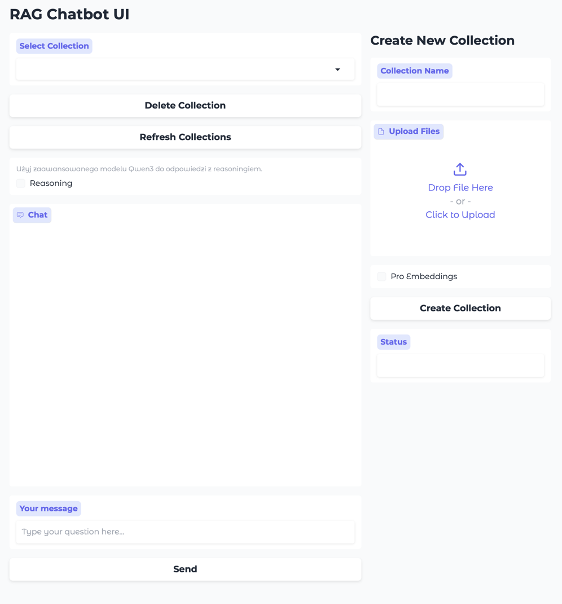

## README

Poniższy dokument opisuje instalację, konfigurację oraz sposób uruchomienia aplikacji RAG Chatbot UI.



---

## Wymagania wstępne

* System operacyjny: macOS, Windows
* Python 3.8+
* Menedżer pakietów [uv](https://github.com/astral-sh/uv)
* Zainstalowane [ollama](https://ollama.com/) oraz modele wymienione w kodzie

---

## Instalacja narzędzi

### 1. Instalacja `uv`

```bash
# Zainstaluj narzędzie uv
brew install uv
```

### 2. Instalacja `ollama`

Postępuj zgodnie z instrukcją na oficjalnej stronie [Ollama](https://ollama.com/):

```bash
# Przykład instalacji przez Homebrew
brew install ollama
# Jeśli instalacja przez homebrew to uruchomienie serwera:
ollama serve
```

### 3. Pobranie i instalacja modeli Ollama używanych w kodzie

Kod wykorzystuje następujące modele:

* `gemma2:latest` - (główny model do odpowiedzi)
* `gemma3:4b-it-qat` - (pytania do embeddingów)
* `embeddinggemma:latest` (embeddings)
* `qwen3:4b` (opcjonalnie, gdy włączony reasoning)

Aby pobrać te modele:

```bash
# Przykład pobrania modelu generatywnego
ollama pull gemma2:latest 
ollama pull gemma3:4b-it-qat

# Przykład pobrania modelu do embeddings
ollama pull embeddinggemma:latest

# Przykład pobrania modelu reasoningowego (opcjonalnie)
ollama pull qwen3:4b
```

---

## Uruchomienie aplikacji

Po ściągnięciu repozytorium, aplikację uruchamiamy za pomocą:

```bash
git clone https://github.com/growdelan/simple-local-rag.git
```

```bash
cd simple-local-rag
```

```bash
uv run ui/app.py
```

Aplikacja wystartuje pod adresem `http://localhost:7860`.

---

## Opis funkcji

Aplikacja RAG Chatbot UI oferuje następujące możliwości:

1. **Zarządzanie kolekcjami dokumentów**

   * Tworzenie nowej kolekcji (upload plików, wybór trybu Pro/standardowego)
   * Usuwanie istniejących kolekcji
   * Odświeżanie listy kolekcji bez restartu serwera

2. **Proces ingestowania dokumentów**

   * Wczytywanie dokumentów z katalogu `./data/{collection_name}`
   * Dzielenie tekstu na fragmenty (SentenceSplitter)
   * (Opcjonalnie, tryb Pro Embeddings)

     * Wyodrębnianie tytułów (TitleExtractor)
     * Generowanie pytań na podstawie kontekstu (QuestionsAnsweredExtractor)
   * Zapis wygenerowanych fragmentów do pliku `output.txt`
   * Persistencja wektorów do bazy ChromaDB

3. **Chatbot RAG**

   * Zapytania do wybranej kolekcji dokumentów
   * Opcja włączenia reasoning (model `qwen3:4b`)
   * Streaming odpowiedzi token po tokenie
   * Parsowanie wewnętrznych przemyśleń (`<think>...</think>`) i wyświetlanie ich w rozwijanym detalu

4. **Interfejs użytkownika (Gradio)**

   * Przyjazny UI z kolumnowym podziałem:

     * Lewa kolumna: wybór kolekcji, czat, pole do wpisywania pytań
     * Prawa kolumna: formularz tworzenia kolekcji
   * Podświetlanie statusów operacji (tworzenie/usuwanie kolekcji)

---

## Licencja

Projekt dostępny na licencji MIT. Możesz dowolnie modyfikować i wykorzystywać kod.
