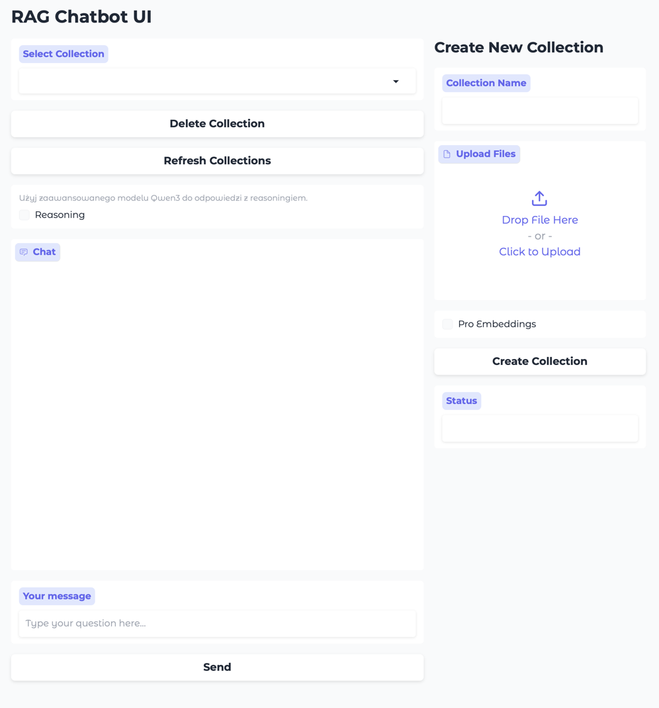

## README

Poniższy dokument opisuje instalację, konfigurację oraz sposób uruchomienia aplikacji RAG Chatbot UI.



---

## Wymagania wstępne

* System operacyjny: macOS, Windows
* Python 3.11+
* Menedżer pakietów [uv](https://github.com/astral-sh/uv)
* Zainstalowane [ollama](https://ollama.com/) oraz modele wymienione w kodzie

---

## Instalacja narzędzi

### 1. Instalacja `uv`

```bash
# Zainstaluj narzędzie uv
brew install uv
```

### 2. Instalacja `ollama`

Postępuj zgodnie z instrukcją na oficjalnej stronie [Ollama](https://ollama.com/):

```bash
# Przykład instalacji przez Homebrew
brew install ollama
# Jeśli instalacja przez homebrew to uruchomienie serwera:
ollama serve
```

### 3. Pobranie i instalacja modeli Ollama używanych w kodzie

Kod wykorzystuje następujące modele:

* `ornith-1.5:9b` - (domyślny model odpowiedzi, również w trybie Reasoning)
* `gemma3:4b-it-qat` - (pytania do embeddingów)
* `embeddinggemma:latest` (embeddings)

Aby pobrać te modele:

```bash
# Przykład pobrania modelu generatywnego
ollama pull ornith-1.5:9b
ollama pull gemma3:4b-it-qat

# Przykład pobrania modelu do embeddings
ollama pull embeddinggemma:latest
```

---

## Uruchomienie aplikacji

Po ściągnięciu repozytorium, aplikację uruchamiamy za pomocą:

```bash
git clone https://github.com/growdelan/simple-local-rag.git
```

```bash
cd simple-local-rag
```

```bash
uv run ui/app.py
```

Aplikacja wystartuje pod adresem `http://localhost:7860`.

---

## Opis funkcji

Aplikacja RAG Chatbot UI oferuje następujące możliwości:

1. **Zarządzanie kolekcjami dokumentów**

   * Tworzenie nowej kolekcji (upload plików, wybór trybu Pro/standardowego)
   * Usuwanie istniejących kolekcji
   * Odświeżanie listy kolekcji bez restartu serwera

2. **Proces ingestowania dokumentów**

   * Wczytywanie dokumentów z katalogu `./data/{collection_name}`
   * Dzielenie tekstu na fragmenty (SentenceSplitter)
   * (Opcjonalnie, tryb Pro Embeddings)

     * Wyodrębnianie tytułów (TitleExtractor)
     * Generowanie pytań na podstawie kontekstu (QuestionsAnsweredExtractor)
   * Zapis wygenerowanych fragmentów do pliku `data/<kolekcja>/debug_chunks.txt`
   * Persistencja wektorów do bazy ChromaDB

3. **Chatbot RAG**

   * Zapytania do wybranej kolekcji dokumentów
   * Opcja włączenia reasoning (ten sam model z włączonym thinking)
   * Wyświetlenie odpowiedzi po sprawdzeniu pochodzenia cytatów
   * Opcjonalny tryb thinking; ślad rozumowania pozostaje ukryty, wyświetlana jest sprawdzona odpowiedź

4. **Interfejs użytkownika (Gradio)**

   * Przyjazny UI z kolumnowym podziałem:

     * Lewa kolumna: wybór kolekcji, czat, pole do wpisywania pytań
     * Prawa kolumna: formularz tworzenia kolekcji
   * Podświetlanie statusów operacji (tworzenie/usuwanie kolekcji)

---

## Licencja

Projekt dostępny na licencji MIT. Możesz dowolnie modyfikować i wykorzystywać kod.

## Profil wydajności dla Mac Mini M1 16 GB

Domyślnie reranker ocenia 16 kandydatów i wybiera 4 fragmenty.
Bez rerankingu wyszukiwane są 4 fragmenty. Zachowujemy pełną treść fragmentów,
żeby nie usuwać informacji niezbędnych do interpretacji scen.
Odpowiedź powstaje jako JSON z twierdzeniami i identyfikatorami zdań.
Format jest wymuszany schematem JSON przekazanym do Ollamy. Następnie
krótkie wywołanie tego samego modelu sprawdza zgodność z pytaniem i cytatami
(limit 64 tokenów, bez thinking). Nie ma pętli kolejnych generacji refine.
Kontekst przekraczający budżet jest przycinany od końca.
Może to ograniczyć kompletność odpowiedzi na pytania wymagające wielu źródeł.
Okno pozostaje na 8192 tokenach, a limit odpowiedzi na 512.
Nie trzeba ponownie indeksować istniejących kolekcji.

Reranker ładuje się dopiero przy pierwszym pytaniu z włączonym Rerank
(pierwsze użycie będzie wolniejsze) i pozostaje w pamięci do zamknięcia aplikacji.
Aby pracować bez jego kosztu pamięci, uruchom aplikację ponownie i odznacz Rerank
przed pierwszym pytaniem. CPU pozostaje domyślnym urządzeniem; `RERANK_DEVICE=mps`
pozwala porównać akcelerację Apple GPU na własnych danych.

Konfiguracja przez zmienne środowiskowe:

| Zmienna | Domyślnie | Znaczenie |
|---|---|---|
| `STANDARD_MODEL` | `ornith-1.5:9b` | Model odpowiedzi |
| `PRO_MODEL` | wartość `STANDARD_MODEL` | Model w trybie Reasoning |
| `RERANK_CANDIDATES` | `16` | Liczba kandydatów ocenianych przez reranker |
| `RERANK_TOP_N` | `4` | Liczba źródeł po rerankingu |
| `KNN_TOP_K` | `4` | Liczba źródeł bez rerankingu |
| `RERANK_MAX_LENGTH` | `1024` | Maksymalna długość pary pytanie–fragment |
| `RERANK_DEVICE` | `cpu` | Urządzenie rerankera |
| `DEBUG_CONTEXT` | `false` | Wypisywanie wybranych fragmentów w terminalu |

Przykład porównania GPU:

```bash
RERANK_DEVICE=mps uv run ui/app.py
```

Logi `RAG` pokazują czas embeddingu, wyszukiwania, rerankingu (wraz z ewentualnym
ładowaniem modelu), czas do pierwszego wewnętrznego tokenu oraz generacji i całości od rozpoczęcia
embeddingu. Pełne fragmenty są wypisywane tylko przy `DEBUG_CONTEXT=true`.
Operacje ingestowania, usuwania i oba sposoby wysyłania pytań mają wspólną kolejkę,
żeby nie uruchamiać kilku kosztownych operacji jednocześnie. Odpowiedź pojawia się
w całości po kontroli źródeł i zgodności z pytaniem; wewnętrzne tokeny JSON nie są wyświetlane.

Izolowany test na sztucznych danych, bez pobierania modeli:

```bash
uv run test/performance_scenario.py
```

Test sprawdza zapis i odczyt Chroma, liczbę nodów, oba warianty retrieval,
obsługę odpowiedzi, odrzucanie nieistniejących identyfikatorów źródeł oraz brak duplikatów po ponownym utworzeniu kolekcji. Używa zastępczych
modeli, więc nie mierzy szybkości ani jakości odpowiedzi rzeczywistego LLM.

## Odpowiedzi oparte na cytatach

Model wybiera do trzech zdań oznaczonych identyfikatorami i odpowiada na ich
podstawie. Instrukcje wymagają uwzględnienia negacji, postaci, metafor i różnic
między scenami. Aplikacja sprawdza, czy wskazane zdanie w całości występowało
w kontekście przekazanym modelowi. Cytat wraz z sąsiednimi zdaniami kopiuje ze źródła, a nazwę pliku i stronę
pobiera z metadanych bazy; model nie generuje tych elementów.
Niepoprawny JSON lub nieistniejący identyfikator powoduje odrzucenie odpowiedzi.
Dodatkowa kontrola LLM wybiera tylko twierdzenia odpowiadające na pytanie
i poparte cytatem, usuwając pozostałe. To heurystyka modelowa, nie formalny dowód poprawności.
Pusta lista dowodów daje komunikat o braku odpowiedzi w dostarczonych fragmentach.

Kontrola źródeł potwierdza pochodzenie cytatów, ale nie gwarantuje poprawnej
interpretacji przez model. Przy wnioskach wymagających wielu scen sprawdzaj
cytaty; wyszukiwanie obejmuje wybrane fragmenty, a nie całą książkę naraz.

Opcjonalna regresja na istniejącej kolekcji „1Q84”, z rzeczywistymi modelami:

```bash
uv run test/grounding_live.py --collection 1Q84_full
```

Scenariusz odczytuje kolekcję i sprawdza pytania o księżyce, przejście Aomame
oraz brak informacji o numerze konta. Nie zmienia dokumentów ani indeksu.
Sprawdzenia tekstowe są pomocnicze; nadal należy ocenić sens odpowiedzi i cytatów.

Domyślny Ornith 9B został wybrany dla trafności. Na M1 16 GB odpowiedzi mogą
trwać kilkadziesiąt sekund i powodować użycie swapu przy innych otwartych
aplikacjach. Lżejszy wariant do porównania (mniej niezawodny w testach fabularnych):

```bash
STANDARD_MODEL=gemma4:e2b-it-qat uv run ui/app.py
```
