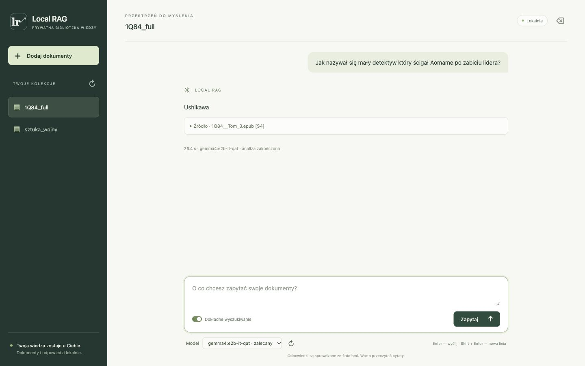

# Local RAG

Lokalna biblioteka dokumentów z odpowiedziami opartymi na cytatach. Frontend to
zwykły HTML, CSS i JavaScript; API działa w FastAPI. Bez Gradio, Node.js,
budowania frontendu oraz zewnętrznych skryptów i fontów.


## Uruchomienie

Wymagania: Python 3.11+, [uv](https://docs.astral.sh/uv/) i lokalna
[Ollama](https://ollama.com/).

```bash
uv sync
ollama pull gemma4:e2b-it-qat
ollama pull embeddinggemma:latest
```

Uruchom aplikację Ollama albo `ollama serve`, a następnie z katalogu repozytorium:

```bash
uv run ui/app.py
```

Otwórz [127.0.0.1:7860](http://127.0.0.1:7860). Serwer nasłuchuje wyłącznie
lokalnie. Port możesz zmienić przez `PORT=7861 uv run ui/app.py`.

## Korzystanie

- Wybierz kolekcję z bocznej biblioteki i wpisz pytanie. Enter wysyła, Shift+Enter
  dodaje nową linię. Każde pytanie wyszukuje źródła samodzielnie; poprzednie
  wiadomości nie są kontekstem modelu.
- „Dokładne wyszukiwanie” włącza reranker. Lekki MiniLM ocenia 24 kandydatów i wybiera
  4 fragmenty. Po wyłączeniu wyszukiwane są 4 fragmenty KNN.
- Odpowiedź pojawia się po kontroli źródeł; cytaty rozwiniesz pod twierdzeniami.
  Podczas pracy interfejs pokazuje aktualny etap analizy i licznik czasu.
- „Dodaj dokumenty” tworzy nową kolekcję. Formaty: PDF, EPUB, DOCX, TXT, MD,
  HTML, CSV; do 30 plików i 100 MB łącznie. PDF musi zawierać warstwę tekstową;
  aplikacja nie wykonuje OCR skanów.
- Opcjonalne wzbogacanie generuje tytuły i pytania. Wydłuża import i domyślnie
  używa tego samego modelu co odpowiedzi.
- Import nie nadpisuje istniejącej kolekcji. Usunięcie kolekcji wymaga
  potwierdzenia w oknie i usuwa jej indeks oraz kopie dokumentów w `data/`.

Dotychczasowe kolekcje w `chroma_db/` działają bez ponownego indeksowania.
Rozmowy pozostają w pamięci strony i znikają po odświeżeniu lub zmianie kolekcji.
W jednym procesie trwa najwyżej jedna kosztowna operacja; kolejne żądanie z innej
karty otrzyma komunikat o zajętości. Nie uruchamiaj kilku procesów API na tej
samej bazie. UI nie wykonuje zewnętrznych żądań, ale biblioteki mogą pobierać
modele i pliki pomocnicze przy pierwszym uruchomieniu.

## Profil dla Maca M1 z 16 GB RAM

Domyślny model to `gemma4:e2b-it-qat`. Odpowiedzi i kontrola źródeł mają
`think=false`, kontekst 4096 oraz limity 384/128 tokenów. Rozumowanie
przed odpowiedzią nie jest potrzebne do każdego krótkiego pytania i w poprzednim
profilu Ornith 9B potrafiło zużyć cały limit 4096 tokenów bez wyniku.
Przełącznik **Think** w UI włącza lub wyłącza rozumowanie dla odpowiedzi, próby pomocniczej i weryfikacji. Wybór jest zapamiętywany, domyślnie wyłączony. Wymaga modelu obsługującego thinking i może wydłużyć odpowiedź. Tryb włączony ma limit 1536 tokenów generacji oraz 1536 dla weryfikacji (zmienne `THINK_NUM_PREDICT` i `THINK_VERIFY_NUM_PREDICT`). Dla wywołań bez jawnego wyboru `RAG_THINKING=default` przywraca ustawienie
modelu. Przy takim eksperymencie trzeba też odpowiednio dobrać budżet generacji.
[Dokumentacja thinking](https://docs.ollama.com/capabilities/thinking).

W trybie Think limit obejmuje rozumowanie i wynik. Wyczerpanie limitu odpowiedzi lub weryfikacji kończy pytanie czytelnym komunikatem, bez HTTP 500 i bez ujawniania niezweryfikowanej odpowiedzi. Aplikacja nie wyłącza wtedy automatycznie Think.

Reranker to wielojęzyczny MiniLM, przetwarzający małe partie na CPU, z 4 wątkami.
Nie zajmuje GPU podczas generowania odpowiedzi. Ładuje się dopiero przy pierwszym
użyciu i pozostaje w pamięci procesu. Model embeddingów jest zwalniany z Ollamy
po embeddingu pytania; import nadal korzysta z niego seryjnie.
[Karta MiniLM](https://huggingface.co/cross-encoder/mmarco-mMiniLMv2-L12-H384-v1).

Model wskazuje rzeczywiste fragmenty źródłowe zamiast pojedynczych wyrwanych
z dialogu zdań. Aplikacja sprawdza identyfikatory, kopiuje cytaty i osobno ocenia
każde twierdzenie: czy jest poparte źródłem oraz czy odpowiada na pytanie.
Krótka ocena przed werdyktem pomaga odrzucać odpowiedzi, które tylko powtarzają
pytanie. Nie jest wyświetlana użytkownikowi. To kontrola modelowa, nie gwarancja
poprawności: szczególnie trudne pozostają metafory, aluzje oraz pytania o wiele scen.

Gdy pierwsza odpowiedź jest pusta albo nie przejdzie kontroli, aplikacja wykonuje
jedną próbę prostym tekstem na tych samych fragmentach. Pomaga to małej Gemmie,
która czasem pomija poszukiwany fakt przy generowaniu JSON. Próba wymaga poprawnego
identyfikatora źródła i zawsze przechodzi weryfikację; nie wyłącza zabezpieczeń ani
nie korzysta z wiedzy spoza dokumentów. Może wydłużyć pytania bez odpowiedzi.
Pytanie „Gdzie Aomame zabiła lidera?” po tej zmianie dało „w apartamencie w hotelu
Okura” z cytatem z tomu 3, z rerankerem i bez niego (21,3 s i 14,0 s w kolejnych
próbach, z modelem już załadowanym; nie są to pomiary zimnego startu).

Budżet kontekstu uwzględnia prompt, pytanie i odpowiedź. Przycinanie zachowuje
pełne zdania; cytat nigdy nie obejmuje usuniętego końca źródła. Limit generacji
lub czasu daje wyraźny błąd, nie fałszywe stwierdzenie, że książka nie zawiera danych.
Logi pokazują oddzielnie embedding, wyszukiwanie, reranking, przetwarzanie promptu,
generowanie oraz weryfikację. Przejrzystość etapów nie wymaga wyświetlania rozumowania.

## Pomiary na M1 16 GB (2026-10-03)

Końcowy test przez UI po zatrzymaniu modelu w Ollamie i ponownym uruchomieniu
`uv run ui/app.py`: pytanie „Jak nazywał się mały detektyw który ścigał Aomame
po zabiciu lidera?” dało **Ushikawa**, z cytatem z tomu 3, w **26,4 s**.

| Etap zimnego startu | Czas |
|---|---:|
| Embedding i wyszukiwanie | 1,1 s |
| Ładowanie rerankera i selekcja | 7,0 s |
| Ładowanie LLM, prompt i odpowiedź | 13,9 s |
| Weryfikacja twierdzenia | 4,3 s |

Wcześniejszy log Ornith 9B pokazywał 30,7 s przetwarzania promptu oraz
411,6 s generowania 4096 tokenów, zakończonego limitem. Był używany w 100% GPU.
Po optymalizacji Ollama raportowała 3,6 GB dla Gemmy E2B (wcześniej 5,8 GB dla
Ornith). To pomiary konkretnych wywołań, nie gwarancja czasu każdego pytania.
Ponowne identyczne pytania mogą korzystać z cache promptu i nie są miarodajnym
pomiarem zimnego startu.

Porównano też Qwen 3.5 4B/9B, Gemmę E4B, większy reranker na MPS,
szersze konteksty i warianty wyszukiwania. Nie uzasadniły zastąpienia szybkiego
profilu w tych próbach; modele pobrane wyłącznie do porównania usunięto.

**Ograniczenia jakości wydania v1.12:** w ścisłej regresji książkowej 2 z 4 przypadków
były kompletne (nazwisko i prawidłowy brak numeru konta). Opis księżyców pomijał
żółty kolor dużego księżyca, a odpowiedź o przejściu między światami opisywała
przyczynę fabularną zamiast sceny ze schodami. Skrypt `grounding_live.py`
sygnalizuje te dwie niepełne odpowiedzi jako FAIL. Testy techniczne API, Chroma,
ograniczeń źródeł i ustawień modeli przechodzą. Przyspieszenie nie oznacza
pełnej poprawności interpretacji książki.

Po dodaniu próby pomocniczej i dwóch pytań o miejsce zabójstwa regresja daje
4/6 PASS: oba warianty miejsca, nazwisko i brak numeru konta. Dwa wcześniejsze
problemy (księżyce i przejście między światami) nadal pozostają nierozwiązane.

Kolekcje pozostały niezmienione: `1Q84_full` — 1476 fragmentów,
`sztuka_wojny` — 315. Nie wykonywano ponownego indeksowania danych użytkownika.



## Konfiguracja

| Zmienna | Domyślnie | Znaczenie |
|---|---|---|
| `STANDARD_MODEL` | `gemma4:e2b-it-qat` | Zalecany model odpowiedzi i weryfikacji |
| `QUESTION_MODEL` | wartość `STANDARD_MODEL` | Model opcjonalnego wzbogacania importu |
| `OLLAMA_NUM_CTX` | `4096` | Okno kontekstu odpowiedzi |
| `OLLAMA_NUM_PREDICT` | `384` | Limit generacji odpowiedzi |
| `VERIFY_NUM_PREDICT` | `128` | Limit oceny jednego twierdzenia |
| `RAG_THINKING` | `false` | `false`, `true` lub `default` |
| `RAG_TIMEOUT` | `90` | Limit sekund pojedynczej generacji, nie całego pytania |
| `VERIFY_ANSWERS` | `true` | Osobna kontrola twierdzeń; zalecana |
| `ENRICH_NUM_CTX` | `8192` | Kontekst opcjonalnego wzbogacania |
| `ENRICH_NUM_PREDICT` | `4096` | Budżet opcjonalnego wzbogacania |
| `RERANK_MODEL_NAME` | `cross-encoder/mmarco-mMiniLMv2-L12-H384-v1` | Reranker |
| `RERANK_CANDIDATES` | `24` | Kandydaci do rerankingu |
| `RERANK_TOP_N` | `4` | Wybrane źródła |
| `KNN_TOP_K` | `4` | Źródła bez rerankingu |
| `RERANK_DEVICE` | `cpu` | Urządzenie rerankera |
| `RERANK_THREADS` | `4` | Wątki PyTorch |
| `RERANK_MAX_LENGTH` | `512` | Długość pary pytanie–fragment |
| `RERANK_WINDOW_TOKENS` | `160` | Długość dodatkowych okien ocenianych wewnątrz fragmentu |
| `RERANK_WINDOW_OVERLAP` | `64` | Nakładanie sąsiednich okien |
| `RERANK_WINDOW_WEIGHT` | `0.5` | Udział najlepszego okna w ocenie; `0` przywraca poprzedni ranking |
| `DEBUG_CONTEXT` | `false` | Wypisywanie kontekstu w terminalu |

Zmiana modelu odpowiedzi nie wymaga ponownego indeksowania. Każdy model
ma inną szybkość i trafność, więc wybranie większego modelu nadal może wydłużyć czas.

## Struktura i testy

- `ui/app.py` — pipeline RAG i punkt uruchomienia.
- `ui/server.py` — lokalne API, upload i blokada współbieżnych operacji.
- `ui/static/` — interfejs bez frameworka.
- `data/`, `chroma_db/` — lokalne dokumenty i baza, wykluczone z Git.

Testy bez uruchamiania modeli:

```bash
uv run test/performance_scenario.py
uv run test/web_scenario.py
uv run test/model_defaults.py
uv run test/retrieval_scenario.py
```

Pierwszy sprawdza zapis Chroma, liczbę nodów, oba tryby wyszukiwania i walidację
źródeł. Drugi sprawdza HTTP, upload, usuwanie, walidację, blokadę i frontend.
Trzeci sprawdza szybki profil, opcję domyślnego thinking, ukrycie jego śladu i limit generacji.
Czwarty odtwarza przypadek, w którym informacja na końcu długiego dokumentu
znikała przez obcięcie wejścia rerankera; sprawdza również zachowanie całego źródła i cytatu.

Opcjonalna regresja na istniejącej kolekcji „1Q84”, z rzeczywistymi modelami:

```bash
uv run test/grounding_live.py --collection 1Q84_full
```

Scenariusz nie zmienia kolekcji; sprawdza detektywa, księżyce, przejście Aomame
i pytanie bez dowodów. Ocenia tekst odpowiedzi bez cytatów, żeby cytat z właściwym
słowem nie maskował błędnej odpowiedzi. Nie zastępuje to ręcznej oceny jakości.
Opcja `--model NAZWA` pozwala porównać inny model.

### Wybór modelu

Pod polem pytania wybierz model dostępny w lokalnej Ollamie. Lista pokazuje modele
obsługujące generowanie tekstu (bez modeli służących wyłącznie do embeddingów).
Przycisk ↻ odświeża listę po pobraniu lub usunięciu modelu. Przeglądarka zapamiętuje
wybór; dotyczy on odpowiedzi i weryfikacji źródeł. Profil aplikacji kontroluje
reasoning przez `RAG_THINKING`. Pierwsze otwarcie nowego profilu wybiera model
zalecany; późniejsze wybory są zapamiętywane. Model embeddingów i opcjonalne wzbogacanie importu
pozostają konfigurowane osobno. Połączenie z Ollamą ustawia `OLLAMA_HOST`
(domyślnie `http://localhost:11434`).

## Porównanie promptów i kontrola jakości (2026-10-03)

### Późniejsza poprawka wyszukiwania

W „Dokładnym wyszukiwaniu” MiniLM ocenia teraz dwa widoki tych samych 24 kandydatów:
dotychczasowy fragment oraz krótsze, nakładające się okna obejmujące jego treść.
Ocena końcowa to średnia oceny fragmentu i najlepszego okna. Wybierane są cztery
oryginalne fragmenty; dotychczasowy limit kontekstu może je skrócić. Okna nie zastępują cytatów
i nie wymagają ponownego importu książek ani dodatkowego modelu.

To ogranicza dwa problemy: obcięcie wejścia rerankera przy jego limicie 512 tokenów
oraz pominięcie istotnej informacji wewnątrz dłuższego tekstu. Samo wybieranie
krótkich okien pogarszało inne pytania, dlatego zachowano również ocenę całego
fragmentu. Jeżeli zbiór czterech wybranych źródeł jest taki sam jak wcześniej,
aplikacja zachowuje ich pierwotną kolejność — model był wrażliwy także na jej zmianę.
Parametr `max_length` rerankera opisuje [dokumentacja Sentence Transformers](https://sbert.net/docs/package_reference/cross_encoder/model.html).
Dla pytań zajmujących co najmniej połowę limitu pary aplikacja pomija dodatkowe
okna, żeby nie mnożyć kosztownego przetwarzania długiego pytania.

Na wcześniejszych sześciu pytaniach uzyskano **5/6 zamiast 4/6**. Poprawna odpowiedź
o przejściu Aomame zawiera teraz zejście po schodach awaryjnych z autostrady.
Na dodatkowej piątce oba końcowe warianty uzyskały **3/5**, łącznie **8/11 zamiast
7/11**. Wciąż zawodzą pełny opis księżyców, pseudonim Fukaeri i rozpoznanie Tamaru
jako ochroniarza. W ostatnim przypadku weryfikator przepuszcza błędnego „Lidera”.
Nie jest to gwarancja rzetelności wszystkich odpowiedzi. Mała seria i powtarzane
pytania służą diagnozie regresji, nie ocenie jakości na całej literaturze.

Ostatnie trzy nowe pytania, już po ustaleniu wariantu, dały **2/3 dla obu wersji**.
Łącznie uzyskano **10/14 zamiast 9/14**. Obie wersje odmówiły odpowiedzi o wyspie,
na której urodził się Tamaru, mimo że książka podaje tę informację.
Odpowiedzi, ręczne uwagi i warunki porównania zapisano w
[`test/retrieval_eval_results.json`](test/retrieval_eval_results.json), bez cytatów z książek.
Końcowe zapytania trwały około **16–31 s** (mediana 20,3 s); wcześniejsza wersja
miała medianę 16,6 s. To pomiary z różnych przebiegów, z ładowaniem modeli i zmiennym
obciążeniem komputera, a nie kontrolowany benchmark szybkości.

Samo sortowanie na M1 trwało zwykle około 3–4 sekund po załadowaniu modelu.
Poprawka zwiększa koszt tego etapu; jej celem jest trafność, a nie przyspieszenie
każdego pytania. Próby większego rerankera, samego KNN i dodatkowego wyszukiwania
leksykalnego nie uzasadniły włączenia ich do domyślnej ścieżki.

Logi pokazują teraz pozycje wybranych źródeł wśród kandydatów oraz liczbę źródeł
i rozmiar kontekstu po skróceniu. Pełną treść nadal ujawnia dopiero `DEBUG_CONTEXT=true`.

```bash
# Aktualna ścieżka; zestaw all obejmuje też 3 dodatkowe pytania kontrolne:
uv run test/grounding_live.py --suite all --think off --output .codex/retrieval-new.jsonl
# Poprzedni ranking, z tym samym generatorem i weryfikatorem:
RERANK_WINDOW_WEIGHT=0 uv run test/grounding_live.py --suite all --think off --output .codex/retrieval-old.jsonl
```

Skrypt zapisuje odpowiedzi bez cytatów. Pole `passed` jest heurystyką słów kluczowych;
należy sprawdzić także sens odpowiedzi i jej źródło. Niezerowy kod zakończenia
przy obecnych znanych błędach jest oczekiwany.

### Wcześniejsze porównanie promptów

Przeprowadzono **189 porównawczych wywołań modeli oraz 12 pełnych zapytań RAG**
(dwa przebiegi po 6 pytań). Sprawdzono 7 wariantów promptu generatora, 3 warianty
weryfikatora, ograniczenie kontekstu do wybranych akapitów oraz Think on/off.
Dodatkowo wykonano trzy orientacyjne próby na lokalnym Ornith 9B.

**Decyzja: zachowano dotychczasowy prompt i próbę pomocniczą.** Kandydaci poprawiali
pojedyncze odpowiedzi, ale tracili inne; nie potwierdzono stabilnej przewagi.
Nie zmieniono domyślnego modelu ani nie włączono automatycznie Think.
Komunikat odmowy mówi teraz o niemożności potwierdzenia odpowiedzi — nie przesądza,
że w dokumentach nie ma poszukiwanej informacji.

Weryfikator testowano osobno na poprawnych i błędnych twierdzeniach:

| Wariant | Seria rozwojowa | Nowa seria kontrolna | Mediana czasu kontroli |
|---|---:|---:|---:|
| Obecny, Think off | 13/14 | 7/8 | 2,83 s |
| Ostrzejszy, Think off | 14/14 | 6/8 | 3,80 s |
| Obecny, Think on | — | 7/8 | 14,06 s |
| Ostrzejszy, Think on | — | 7/8 | 13,69 s |

Ostrzejszy wariant bez Think odrzucał poprawne sprostowanie błędnego założenia
pytania. Z Think jeden przypadek skończył się niekompletnym JSON po limicie.
Obecny weryfikator błędnie akceptował dosłowną interpretację metafory. Takie wyniki
nie uzasadniają deklaracji, że weryfikacja gwarantuje prawdziwość odpowiedzi.

Oba końcowe przebiegi `1Q84_full` dały **4/6**: hotel (dwa sformułowania), Ushikawa
i brak numeru konta. Opis księżyców nadal był niepełny/niejednoznaczny, a odpowiedź
o przejściu podawała przyczynę fabularną zamiast sceny ze schodami. W wybranych
źródłach do tego ostatniego pytania nie było sceny zejścia z autostrady. To wymaga
poprawy wyszukiwania; prompt nie powinien uzupełniać brakującego dowodu z pamięci.

### Jak odtworzyć porównanie

```bash
# Syntetyczne źródła, niezależnie od jakości wyszukiwania:
uv run test/prompt_eval.py --split dev --variants baseline concise extract --think off --output .codex/prompt-eval/new-dev.jsonl
uv run test/prompt_eval.py --split holdout --variants baseline --think off --output .codex/prompt-eval/new-holdout.jsonl
uv run test/verifier_eval.py --split holdout --variants baseline strict --think off --output .codex/prompt-eval/new-verifier.jsonl

# Zapis lokalnych fragmentów książki, następnie identyczne źródła dla wariantów:
uv run test/prompt_eval.py --freeze-book --book-file .codex/prompt-eval/new-book.json
uv run test/prompt_eval.py --split book --book-file .codex/prompt-eval/new-book.json --variants baseline minimal --think on --output .codex/prompt-eval/new-book-on.jsonl

# Pełny pipeline, z wyszukiwaniem, weryfikacją i próbą pomocniczą:
uv run test/grounding_live.py --think off --output .codex/prompt-eval/new-e2e.jsonl
```

Używaj nowego pliku wyników dla każdej serii; JSONL jest dopisywany. Uruchamiaj
porównania seryjnie, bez równoległego zadawania pytań w UI. Pliki ze źródłami książki
pozostają w ignorowanym `.codex/`. `grounding_live.py` kończy się błędem, jeśli któryś
przypadek nie przejdzie; skrypty porównawcze zapisują także nieudane próby.

[Raport pomiarów, decyzje i uwagi z ręcznego przeglądu](test/prompt_eval_results.json).
Zapisano wersję Ollamy, identyfikator modelu, hashe kontekstu i promptu, liczbę
tokenów, czas ładowania/prefill/generowania i błędy. Wyniki `rubric_passed` to
**heurystyka tekstowa**, nie automatyczny dowód poprawności: samo wystąpienie nazwy
hotelu może dotyczyć wywiezienia zwłok zamiast odpowiedzi o miejscu zabójstwa.
Raport wskazuje również zbyt surowe reguły oraz poprawne odmowy.

Pomiary generatora nie obejmują wyszukiwania i weryfikacji. Cache promptu był aktywny;
nie są to czasy zimnego startu ani gwarancja czasu w UI. Pierwszy końcowy test RAG
nakładał się z testami technicznymi i nie służy porównaniu czasu; drugi wykonano
osobno. Mały zestaw, jedna książka i parafrazy nie uzasadniają deklaracji
uniwersalnej trafności lub statystycznie istotnej przewagi.

Podstawy konfiguracji: [Ollama — structured outputs](https://docs.ollama.com/capabilities/structured-outputs)
i [format promptów Gemma 4](https://ai.google.dev/gemma/docs/core/prompt-formatting-gemma4).
Schemat zapewnia strukturę danych; poprawność treści sprawdzamy osobno.

### Kontrolowany test modeli z ręcznie dobranym źródłem

Eksperyment z 4 października 2026 r. znajduje się na branchu
`codex/diagnoza-modeli-z-kontekstem`; nie zmienia działania aplikacji.
Pytania, kryteria oceny i konfigurację ustalono przed generowaniem:

1. Zamrożone 18 pytań i dosłowne, ręcznie wybrane fragmenty EPUB. Dwa pytania
   badają odmowę przy braku informacji w dostarczonym źródle. Manifest zawiera
   pytania, kryteria odpowiedzi, zakresy znaków i SHA-256, bez tekstu książki.
2. Gemma i Ornith dostają identyczne źródła, produkcyjne prompty, `think=false`,
   kontekst 4096 i limity 384/128. Jeden model rezyduje w pamięci naraz.
3. Dwa powtórzenia, odwrócona kolejność modeli w drugim; kolejność pytań jest
   losowana stałym ziarnem, wspólnym dla obu modeli w danym powtórzeniu.
4. Zapisujemy draft, wynik weryfikacji, próbę pomocniczą, końcową odpowiedź,
   tokeny i czas każdego wywołania. Ocena ręczna obejmuje wszystkie twierdzenia,
   przypisanie rozmówców i kompletność; nie wystarcza właściwe słowo kluczowe.
5. Próg użytkowy: przynajmniej 90% w pełni poprawnych odpowiedzi i mediana czasu
   poniżej 20 s. Model jest rozgrzany; koszt ładowania zapisujemy osobno.
   Czas oracle nie obejmuje wyszukiwania — spełnienie progu nie dowodzi jeszcze
   spełnienia go przez całą aplikację.
6. Oddzielny test sześciu par poprawnych/błędnych twierdzeń sprawdza weryfikator.
   Porównanie Gemmy z kontekstem zwykłego wyszukiwania pozwala sprawdzić,
   jak zmiana źródeł wpływa na końcową odpowiedź.

Audyt źródeł podczas pilotażu wykazał braki w sześciu przypadkach: dwóch pytaniach
o hotel, detektywie, ochroniarzu, organizacji i przypisaniu rozmiarów księżycom.
Manifest pilota zachowano jako `test/oracle_cases_pilot.json`; wersja końcowa
`test/oracle_cases.json` zawiera dokładniejsze dowody (dla księżyców drugi fragment).
Pytania, oczekiwane odpowiedzi i konfiguracja modeli nie zmieniły się. Te sześć
przypadków mierzono ponownie dla obu modeli, dwukrotnie. Pozostałe dwanaście
zachowuje identyczne hashe kontekstu i pomiary z pilota. To jawna korekta materiału
testowego po rozpoczęciu badania, nie niezależna walidacja. Fragmenty narracyjne
nadal wymagają rozpoznania rozmówców i powiązania zdań.

```bash
uv run test/oracle_scenario.py
# Pełne odtworzenie końcowego zestawu, już po audycie źródeł:
uv run test/oracle_eval.py --repeats 2 --output .codex/oracle-eval/new-oracle.jsonl
# Uruchamiaj kolejne polecenia dopiero po zakończeniu poprzednich pomiarów:
ollama stop ornith-1.5:9b
uv run test/oracle_verifier.py --model gemma4:e2b-it-qat --output .codex/oracle-eval/new-verifier-gemma.jsonl
ollama stop gemma4:e2b-it-qat
uv run test/oracle_verifier.py --model ornith-1.5:9b --output .codex/oracle-eval/new-verifier-ornith.jsonl
ollama stop ornith-1.5:9b
uv run test/oracle_retrieval.py --output .codex/oracle-eval/new-retrieved.json
uv run test/oracle_eval.py --models gemma4:e2b-it-qat --repeats 1 --contexts .codex/oracle-eval/new-retrieved.json --output .codex/oracle-eval/new-retrieved-answers.jsonl
```

Skrypt wymaga oryginalnych plików w `data/1Q84_full` zgodnych z manifestem
`test/oracle_cases.json`; odmówi cichej zamiany zmienionego źródła. Nie publikuje
źródeł ani strumienia rozumowania. Wynik procesu 0 oznacza zakończenie pomiaru,
a nie zaliczenie testu jakości. Te pytania były już znane z poprzednich prób:
to diagnostyka przy kontrolowanym kontekście, nie niezależny benchmark ogólny.

Wynik z ręcznie dobranym kontekstem (`think=false`, bez kosztu wyszukiwania):

| Model | W pełni poprawne, runda 1 / 2 | Mediana obu rund | Mediana rundy 1 / 2 |
| --- | --- | --- | --- |
| Gemma 4 E2B | 13/18 / 13/18 | 6,70 s | 7,14 / 6,48 s |
| Ornith 1.5 9B | 14/18 / 14/18 | 21,53 s | 26,53 / 17,97 s |

Żaden model nie spełnił progu jakości. Ornith uzyskał o jedną pełną odpowiedź
więcej, za około trzykrotnie większy medianowy czas. To mała próba, nie dowód
ogólnej przewagi. Wszystkie przebiegi zakończyły się bez błędu limitu tokenów.
Rozgrzewkę i ładowanie zapisano osobno; zmienność czasu Ornitha pokazuje wpływ
warunków wykonania i cache. Pomiary nie były wykonywane na bezczynnej maszynie.

Weryfikacja zajmowała 52% czasu Gemmy i 53% czasu Ornitha; razem z generowaniem
prób pomocniczych etapy po pierwszej odpowiedzi zajmowały około 60% czasu.
Pierwsza odpowiedź Gemmy spełniała kryteria w 12/18 przypadków, końcowa w 13/18.
Próba pomocnicza naprawiła pseudonim Fukaeri. W Ornithcie weryfikator odrzucił
poprawny hotel, a później zaakceptował odpowiedź z ponownej próby. Usunął też
twierdzenie zawierające rozmiary księżyców, przez co odpowiedź była niepełna.
Oba modele nie rozpoznały części ról w krótkich dowodach (Ushikawa/Tamaru).
Ornith dopisał kompozytorowi imię nieobecne w źródle, a jego weryfikator to przyjął.

W osobnych sześciu parach kontrolnych Gemma zaakceptowała 6/6 poprawnych
twierdzeń i odrzuciła 5/6 błędnych; Ornith odpowiednio 5/6 i 5/6. Oba
weryfikatory zaakceptowały zamianę kolorów dużego i małego księżyca mimo
jednoznacznego źródła. Nie można więc traktować akceptacji tego samego modelu
jako niezależnego dowodu prawdziwości. Samo wyłączenie weryfikacji też nie
rozwiązuje problemu — w pomiarze część odpowiedzi została naprawiona później.

Z rzeczywistymi czterema źródłami obecnego wyszukiwania Gemma uzyskała **14/18**
w jednym przebiegu. Mediana generowania z weryfikacją i retry wyniosła **14,77 s**,
a samego wyszukiwania **3,94 s** (pierwsze: 11,25 s z ładowaniem). Mediana sumy
czasów sparowanych etapów to **18,94 s**. Etapy uruchamiano oddzielnie, więc ta suma
nie jest bezpośrednim pomiarem czasu w UI; podczas generowania reranker nie
pozostawał w procesie. Przetwarzanie wejściowego promptu zajęło łącznie 229 s
z 307 s pracy generatora, czyli około 75%; generowanie tokenów około 78 s.

Niepowodzenia z rzeczywistymi źródłami:

- **Fukaeri:** S1 zawiera pseudonim i tożsamość, lecz odpowiedź mówi tylko o
  autorstwie książki. Weryfikator ją akceptuje. To problem wykorzystania dowodu.
- **Księżyce:** S1 opisuje kolory i rozmiary, lecz odpowiedź wybiera inne sceny,
  o zasłoniętym księżycu i zmianie świata. Jest niepełna. Nie oceniamy fazy księżyca
  jako stałej cechy we wszystkich scenach książki.
- **Miejsce urodzenia Tamaru:** żaden z czterech wybranych fragmentów nie podaje
  Sachalinu. Końcowa odmowa jest bezpieczna wobec źródeł, ale nie realizuje zadania.
- **Ochroniarz:** po odrzuceniu wzmianki o Tamaru retry podaje „Liderem”; weryfikator
  akceptuje odpowiedź opartą na fragmencie o przywódcy sekty. Myli role postaci.

Szerszy kontekst pomógł w pytaniach o hotel i Ushikawę. Ręcznie wybrane krótkie
fragmenty nie są więc górnym limitem jakości; skracanie kontekstu może zarówno
przyspieszyć, jak i utrudnić identyfikację sceny. Nie ma podstaw, aby całe
niepowodzenie przypisać wyszukiwaniu albo samemu rozmiarowi modelu.

Decyzja po eksperymencie: zachować produkcyjny pipeline i Gemmę jako domyślny
model. Wyniki nie uzasadniają przejścia na Ornitha ani kolejnej przebudowy indeksu
bez osobnego dowodu poprawy. Następny sensowny prototyp to pokazanie znalezionych
fragmentów od razu po wyszukiwaniu, z opcjonalną syntezą modelu. Pozwalałoby to
korzystać ze źródeł przed zakończeniem generowania; nie naprawia samo w sobie
trafności wyszukiwania i wymaga testu użytkowego. Przed kolejną zmianą jakościową
potrzebny jest również nowy, wcześniej nieużywany zestaw pytań. Progu 90% nie
osiągnięto; nie sprawdzano tu innych modeli, `think=true` ani innego silnika inferencji.

W badaniu system aktywnie używał swapu: podczas 83,7 s próbki z Ornithem licznik
`Swapouts` wzrósł o około 1,53 GiB, podczas 97,2 s późniejszej próbki z Gemmą nie
wzrósł. Są to liczniki całego systemu przy innych działających aplikacjach,
a nie pomiar pamięci należącej wyłącznie do modeli. Nie uzasadniają zalecenia
zakupu nowego sprzętu. Kolekcje zachowały 1476 i 315 nodów; kod `ui/` nie zmienił się.

[Wyniki, ręczne oceny, czasy etapów, hashe i konfiguracja](test/oracle_eval_results.json).
Pełne książki, konteksty i surowe logi pozostają poza Git, w `.codex/oracle-eval/`.

### Prototyp: najpierw fragmenty, odpowiedź na żądanie (9 października 2026)

Na tym samym branchu dodano przepływ dwuetapowy. Po wpisaniu pytania kliknij
**Wyszukaj** lub naciśnij Enter. Zobaczysz fragmenty z nazwami dokumentów,
podglądem treści i możliwością rozwinięcia całego tekstu. Ten etap używa embeddingów
i opcjonalnego rerankera, ale nie uruchamia modelu odpowiedzi ani weryfikatora.
Nie wymaga też zainstalowanego modelu do rozmowy; Ollama z embeddingami jest nadal potrzebna.

**Wygeneruj odpowiedź** uruchamia dotychczasowy generator, weryfikację i warunkową
próbę pomocniczą. Używa modelu oraz ustawienia Think wybranego w chwili kliknięcia.
Korzysta z zapamiętanych wyników dla tego konkretnego pytania, bez powtórnego
wyszukiwania. Zmiana pytania w polu edycji nie zmienia wcześniejszych wyników.
Ponowne generowanie jest możliwe również po błędzie; fragmenty pozostają widoczne.
Jeśli budżet kontekstu wymaga skrócenia tekstu, interfejs to sygnalizuje, a cytaty
odpowiedzi zawierają tekst faktycznie przekazany modelowi.

API: `POST /api/search` przyjmuje `collection`, `question`, `rerank`; zwraca
`search_id` i `sources`. `POST /api/answer` przyjmuje `search_id`, `model`, `think`.
Zapamiętane wyniki są przechowywane tylko w RAM: maksymalnie 32 wyszukiwania,
ważność 30 minut. Restart serwera, usunięcie kolekcji lub wyparcie najstarszych
wyników wymagają ponownego wyszukania. Przeglądarka zachowuje wyświetlony tekst
do zmiany kolekcji lub odświeżenia strony. `/api/query` pozostaje zgodne ze starymi
skryptami; nowy frontend go nie używa. Nie zmieniono promptów, modeli ani indeksu.

Testy bez uruchamiania modeli odpowiedzi:

```bash
uv run test/source_first_scenario.py
uv run test/web_scenario.py
uv run test/performance_scenario.py
node --check ui/static/app.js  # opcjonalnie, jeśli Node jest zainstalowany
```

Scenariusz nowego przepływu buduje tymczasowy indeks Chroma z jednym dokumentem,
potwierdza liczbę nodów i sprawdza brak wywołań generatora podczas wyszukiwania,
zapamiętanie źródeł i pytania, wybór modelu/Think, weryfikację, ponowienie po błędzie,
wygasanie wyników, blokadę równoległych operacji i ograniczenie żądań do lokalnej strony.
